# 🎟️ Online Cinema Ticketing System - Java Swing

[](https://www.oracle.com/java/)
[](LICENSE)

## 🧾 Project Overview

This project is an online cinema ticketing system that allows customers to book movie tickets and administrators to manage movies, theaters, users, and showtimes.  
Developed in **Java** with a **Java Swing** graphical interface and connected to a **MySQL** database, this application demonstrates object-oriented programming, GUI development, and database integration.

---

## Demo Video

A short demonstration of the application features:

[](https://github.com/barbouchyoussef/Online-Cinema-Ticketing-System---Java-Swing/raw/main/assets/demo/demo.webm)
*Click the image to download/play the demo video.*

---

## 👥 User Roles & Key Features

### 1. 👤 Customer (User)

- **Account Management:** Create an account and log in securely.
- **Movie Search:** Filter movies by name, genre, or other criteria.
- **Seat Reservation:** Book one or multiple seats for a chosen show (movie, theater, date, number of seats).
- **Payment Simulation:** Complete a simulated payment for reservations.
- **Reservation Management:** Cancel bookings or view reservation details, with tickets generated in **PDF** format.

### 2. 🛠️ Administrator

- **Admin Authentication:** Secure access to the management panel.
- **Movie Management:** Add, edit, or delete movies.
- **User Management:** Manage customer accounts (add, edit, delete).
- **Theater Management:** Add or edit theaters.
- **Show Scheduling:** Assign movies to theaters at specific dates/times.
- **Show Management:** Modify or remove existing showtimes.

---

## 🚀 Getting Started

### ✅ Prerequisites

- **Java JDK 17+**
- **Apache NetBeans** (or any compatible IDE)
- **MySQL**

### ⚙️ Installation & Setup

1. Import the project into NetBeans.
2. Run the SQL script:  
   `cinema/src/main/java/sql/billetteriecinema.sql`  
   to create the database and tables.
3. Update the database connection credentials in `Database.java`.
4. Run the main application file: `Cinema.java`.

---

## 🧪 Example Workflow

### Customer Workflow

1. Sign up and log in.
2. Select a movie → pick a show → reserve seats.
3. Simulate payment → PDF ticket is generated.

### Administrator Workflow

1. Log in to the admin panel.
2. Add a new movie or theater.
3. Schedule a new show for a movie in a theater.

---

## Screenshots

### Authentication
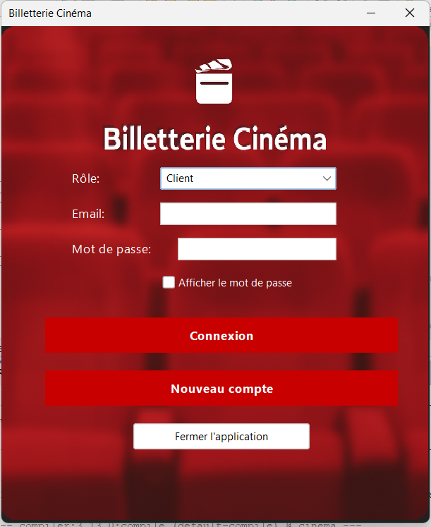  
_Login screen for Client/Admin_

### Client Side
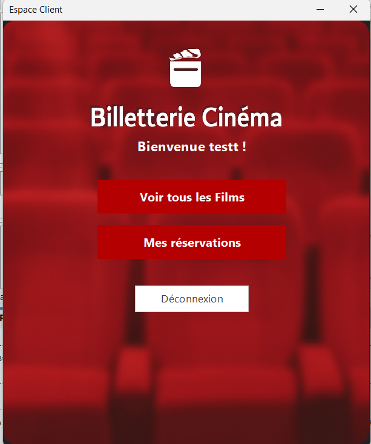  
_Client home page_

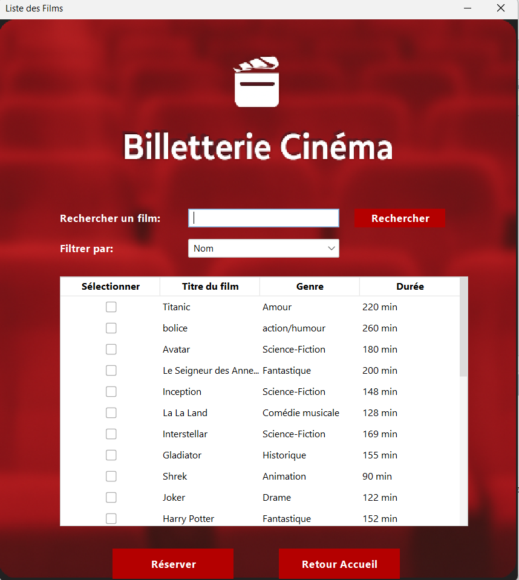  
_Client view of available movies (browse / selection)_

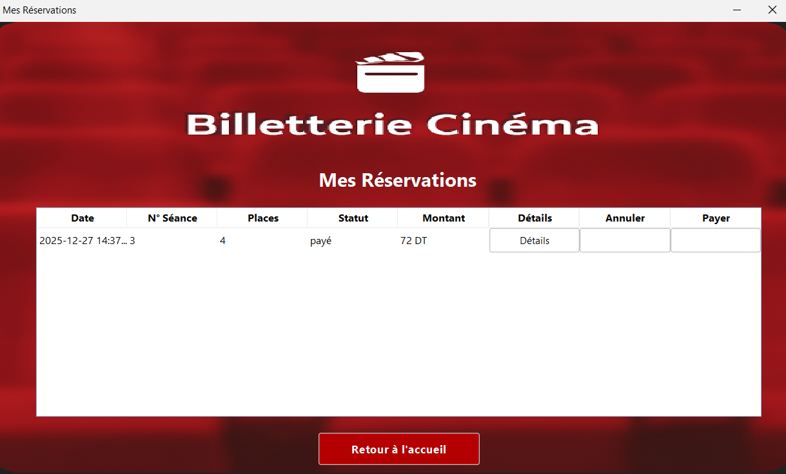  
_List of client reservations_

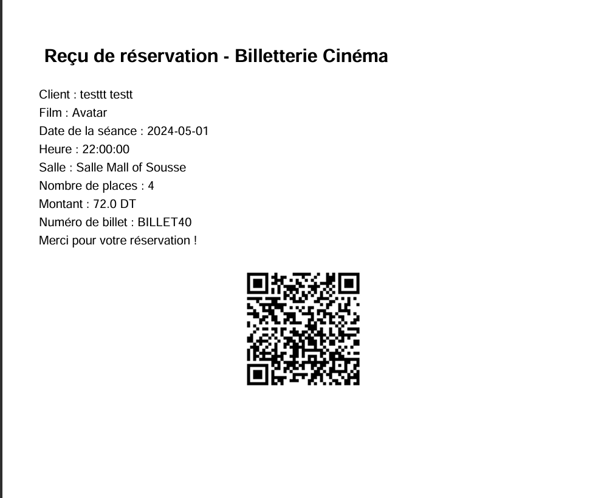  
_Example of ticket generated in PDF_

### Admin Side
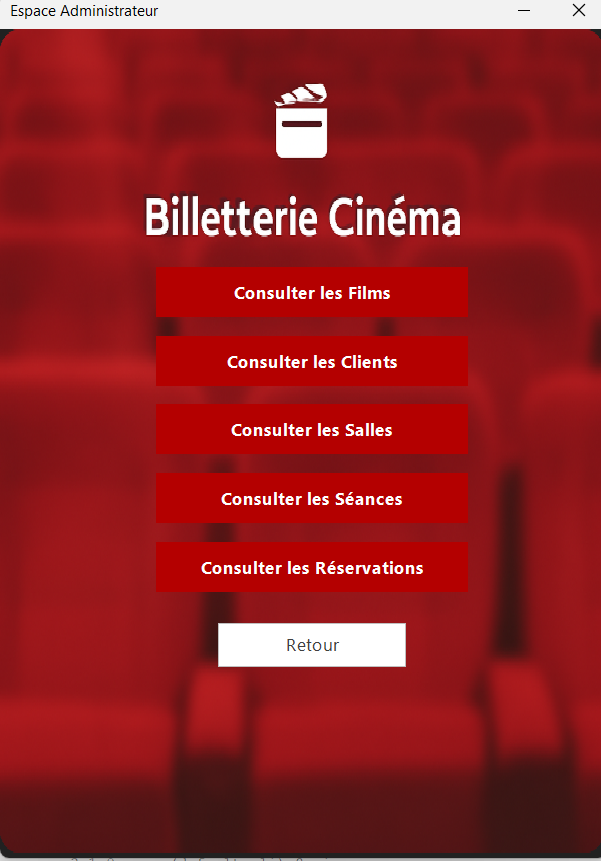  
_Admin home page_

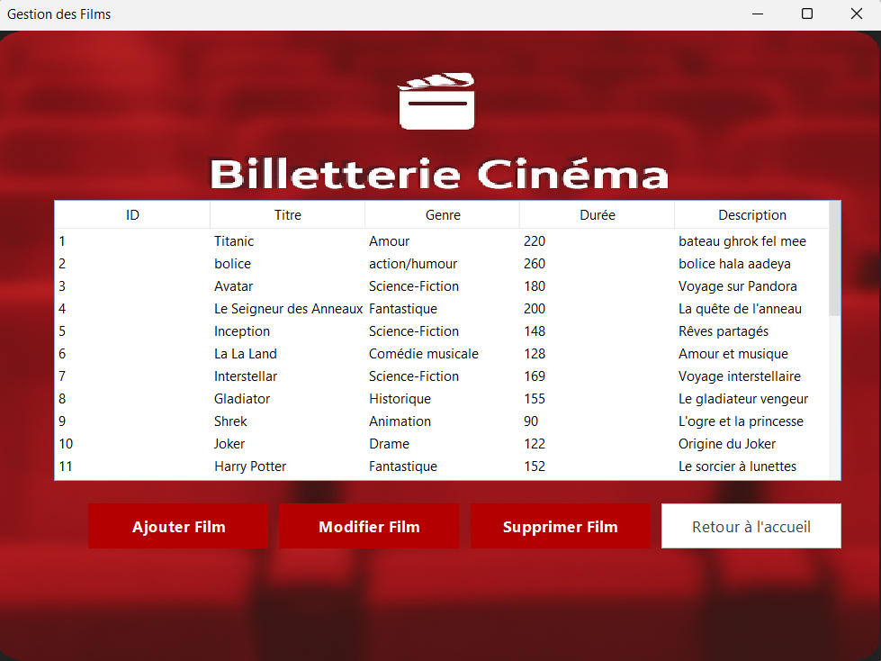  
_Admin movies management (CRUD)_

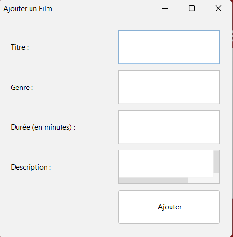  
_Add a new movie_

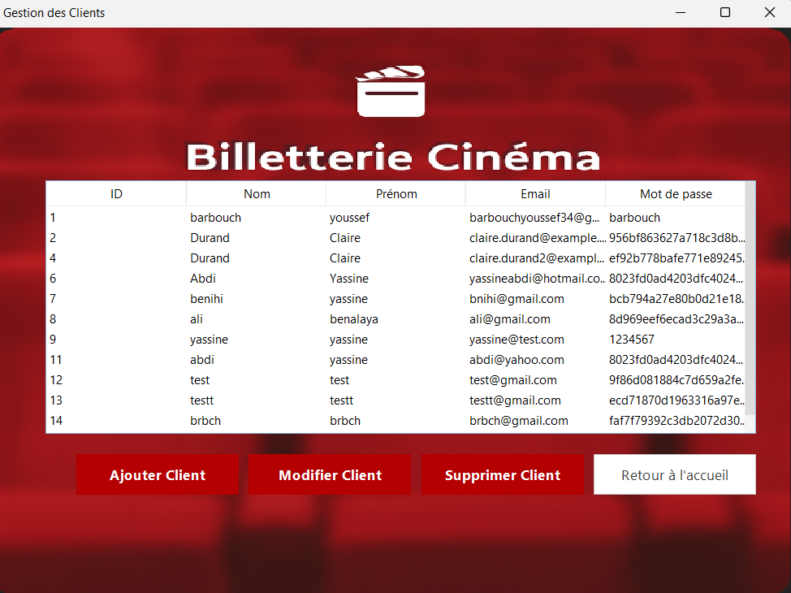  
_Manage customers (CRUD)_

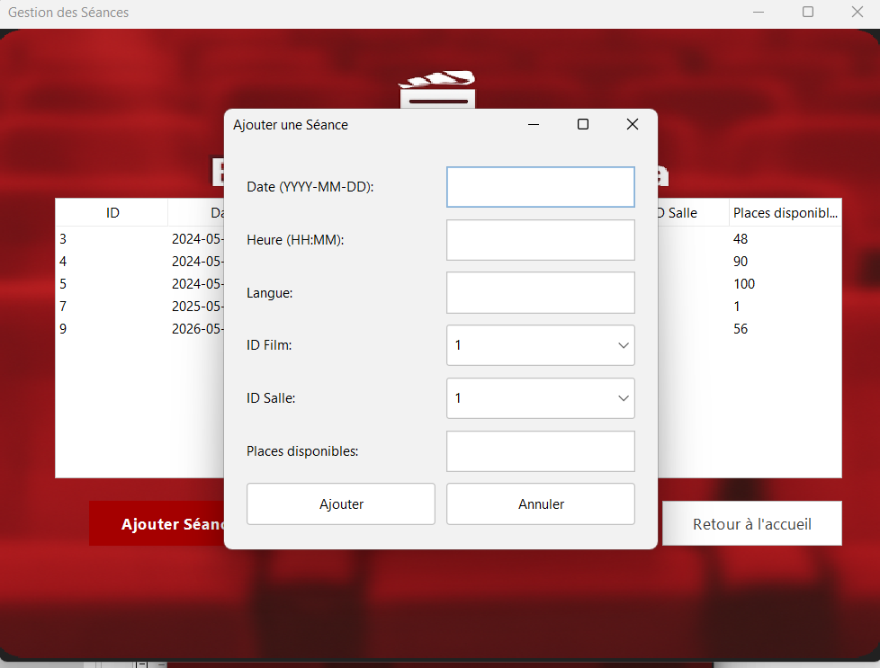  
_Add a new showtime_

### Database
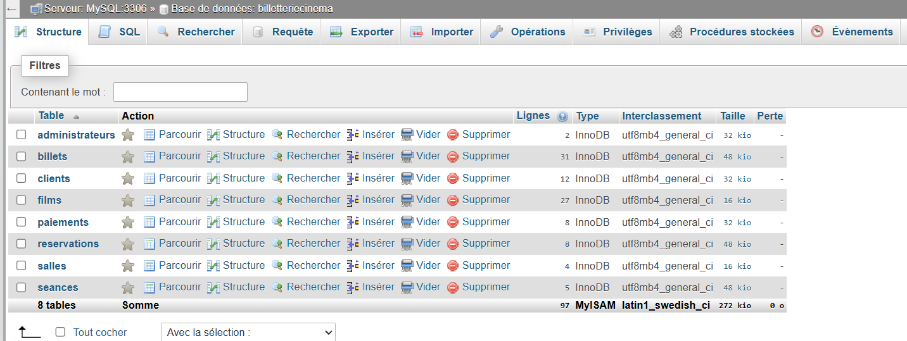  
_Localhost / MySQL database overview_

---

## 📁 Project Structure

```plaintext
cinema/src/main/java/com/mycompany/cinema/
├── dao/         # Data access objects (FilmDAO, ClientDAO, etc.)
├── database/    # Database connection setup
├── gui/         # Java Swing interfaces
├── models/      # Entity classes (Film, Client, Reservation, etc.)
├── tests/       # Unit testing classes
├── utils/       # Utility functions
└── Cinema.java  # Main application launcher
